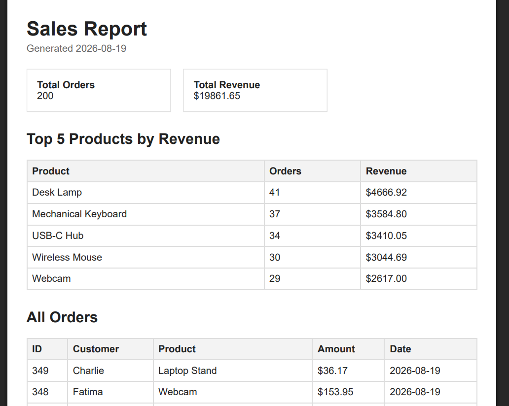

# PDF Report Generator

A FastAPI backend that generates PDF sales reports from SQLite data.

The pipeline is:

SQL query → report data → HTML → PDF → disk storage → download link

## Tech Stack

- Python 3.11
- FastAPI
- SQLite
- Playwright
- Chromium
- Uvicorn

## Dataset

This project uses the "little shop" dataset.

The seed script generates approximately 200 fake orders with:

- customer
- product
- amount
- created_at

Running the seed script multiple times still leaves exactly 200 orders because existing rows are deleted before reseeding.

## Setup

Create and activate a virtual environment:

```bash
python -m venv .venv
```
## PDF Screenshot
